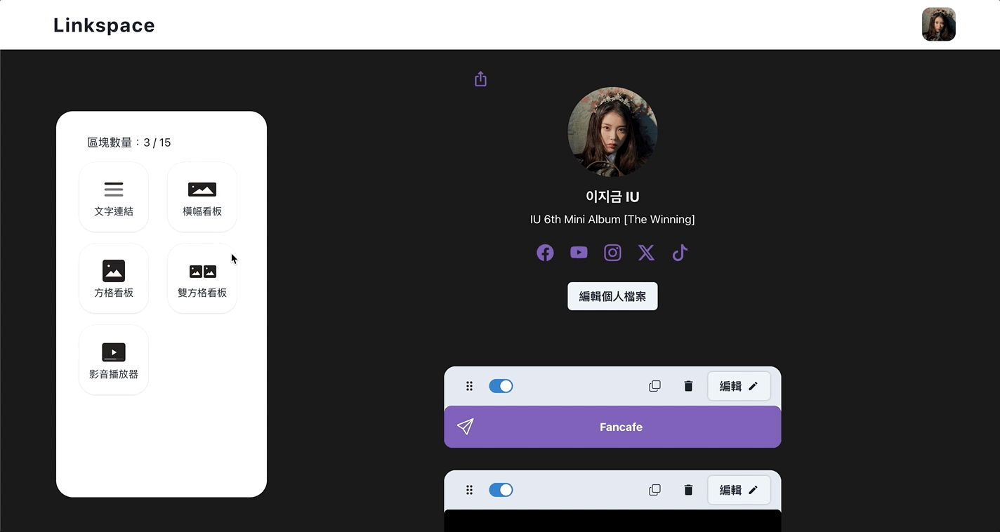
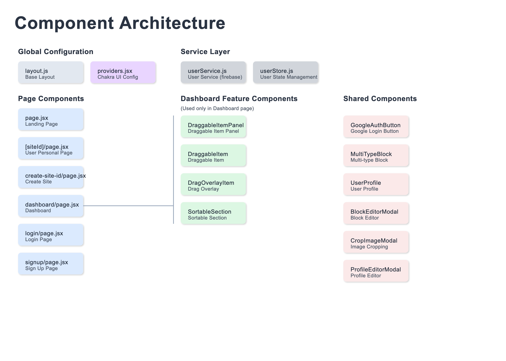

# Linkspace

A powerful and intuitive website building tool that allows users to easily integrate and share their social media links through a personalized landing page.

<div>
  
</div>

> **Note on Development History**  
> This repository is a Next.js implementation of the Linkspace project. The complete development history and commit log can be found in the original React repository at [here](https://github.com/jayredk/linkspace). This version has been reconstructed and optimized using Next.js framework while maintaining all the core functionalities from the original project.

## Table of Contents
- [Demo](#demo)
- [Key Features](#key-features)
- [Technical Highlights](#technical-highlights)
- [System Architecture](#system-architecture)
- [Tech Stack](#tech-stack)
- [Development](#development)

## Demo

### 🌐 Live Demo
- **Product Website**: [linkspace-one.vercel.app](https://linkspace-one.vercel.app/)
- **Sample Profile Page**: [linkspace-one.vercel.app/briantseng](https://linkspace-one.vercel.app/briantseng)

Try creating your own profile at our live demo site!

### 🎬 Feature Showcase

#### Block Management Interface
<div>
  
</div>

- Comprehensive drag and drop system:
  - Add new blocks via drag and drop
  - Reorder existing blocks
- Complete block management:
  - Quick block duplication
  - Easy block deletion
  - Visibility toggle for public/private content

#### Block Editor Interface
<div>
  
</div>

- Type-specific block editing:
  - Demonstrated with Text Link block:
    - Title and URL editing
    - Subtitle toggle option
    - Link customization

- Visual enhancement options:
  - Animation effects selection
    - Wobble animation
    - Shake animation
    - Pulse animation

- Real-time preview for all changes

#### Image Upload System
<div>
  
</div>

- Universal image handling solution:
  - Consistent experience across all image upload points
  - Demonstrated with profile picture upload
- Comprehensive image manipulation:
  - Interactive cropping interface
  - Image scaling/zoom controls
  - Rotation adjustment
  - Real-time preview
- Streamlined upload process:
  - Easy image selection
  - Immediate visual feedback
  - Optimized image processing

#### Theme Customization
<div>
  
</div>

- Showcase different color scheme options
- Show responsive design adaptations

## Key Features

### 🎨 Interactive Editor
- **Drag-and-Drop Block Management**
  - Implemented using dnd kit for smooth reordering
  - Real-time preview synchronization
  - Responsive and mobile-friendly interface

### 📸 Image Processing
- **Smart Image Cropping**
  - Built with react-easy-crop for intuitive image manipulation
  - Optimized for various device sizes and orientations

### ⚙️ Personalization Options
- **Theme Customization**
  - Component-based UI built with Chakra UI
  - Dynamic theme switching with smooth transitions
  - Responsive design system

## Technical Highlights
- Implemented drag-and-drop functionality with optimized performance
- Built real-time preview system with efficient state management
- Designed responsive and accessible UI components
- Integrated smooth animations and transitions
- Created intuitive image processing workflow

## System Architecture
<div>
  
</div>

- **Component Structure**
  - Modular design for maintainability
  - Clear separation of concerns
  - Reusable component patterns

- **State Management**
  - Efficient data flow
  - Optimized re-rendering
  - Persistent storage strategy

## Tech Stack

### Core Technologies
- **React** - Frontend library for building user interfaces
- **Next.js** - React framework for production-grade applications
- **Chakra UI** - Component library for building accessible React applications

### Key Libraries
- **dnd kit** - Modern drag and drop toolkit for React
- **react-easy-crop** - Image cropping component for React
- **React Hook Form** - Performant form validation library
- **Framer Motion** - Animation library for React

## Development

### Prerequisites
```bash
Node.js >= 18.17.0
npm >= 9.6.0
```

### Installation
```bash
# Clone the repository
git clone [repository-url]

# Install dependencies
npm install

# Start development server
npm run dev
```